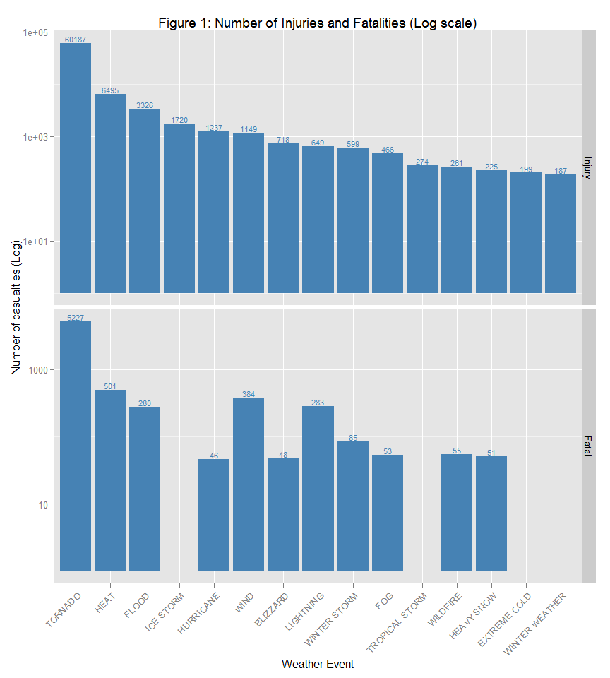
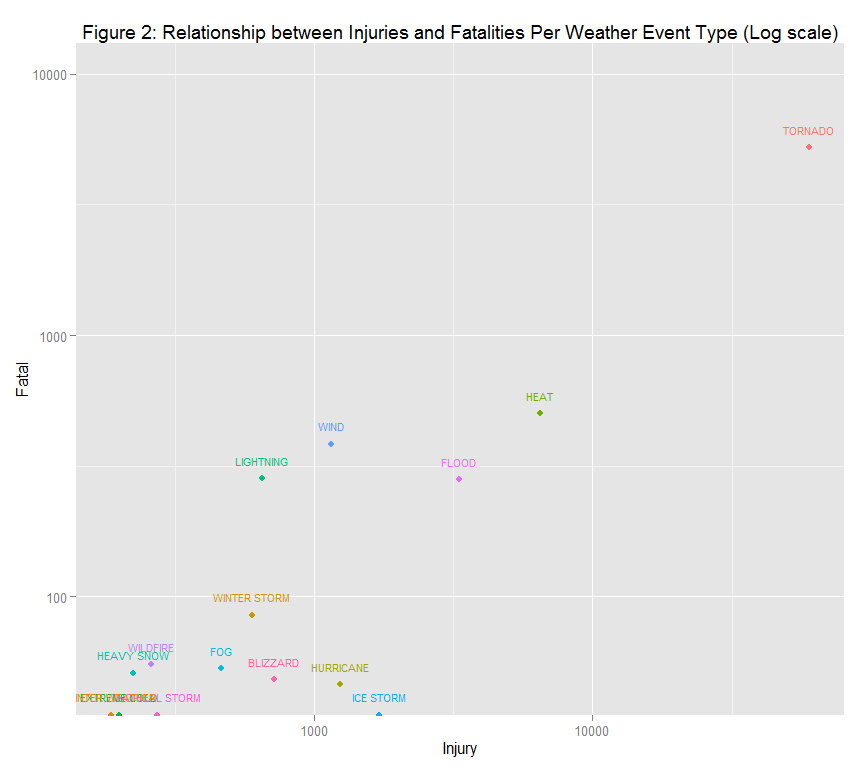
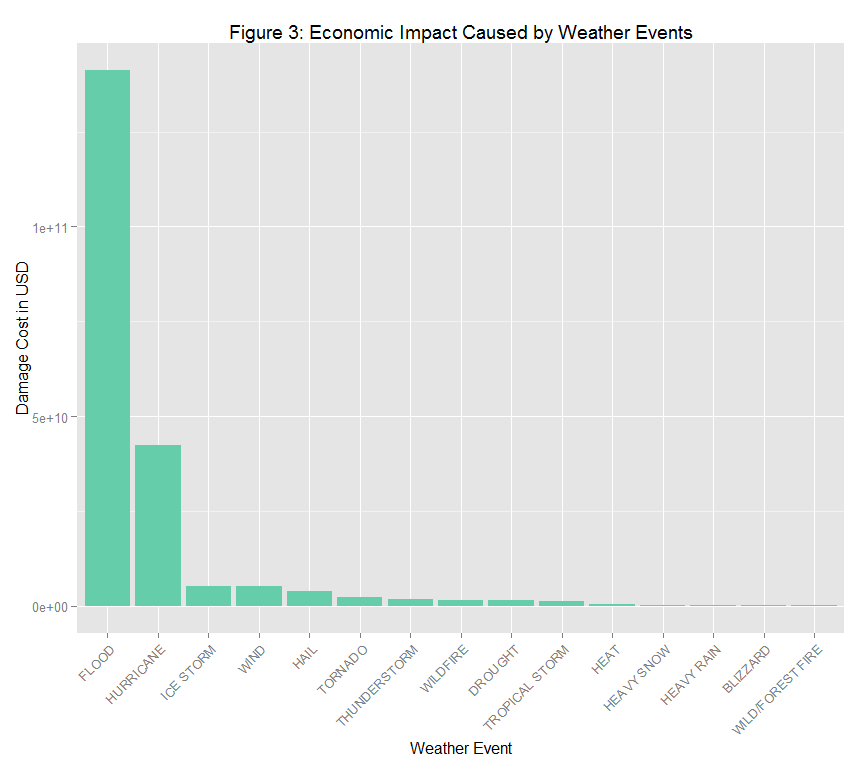

# NOAA Storm Database - Impact with Respect to Population Health and Economic Consequences.
Friday, May 08, 2015  

## Synopsis

This report is an analysis of the U.S. National Oceanic and Atmospheric Administration's (NOAA) Storm Database. The report focuses on two specific aspects of the data: first, the report determines the impact to population health and second, the report reviews the economic impact.


## Data Source

At the time of this report, the data set is located at [this location](https://d396qusza40orc.cloudfront.net/repdata%2Fdata%2FStormData.csv.bz2) (http://d396qusza40orc.cloudfront.net/repdata%2Fdata%2FStormData.csv.bz2).

For more information on this data set, the following documentation is available:-

* National Weather Service Storm Data [Documentation](https://d396qusza40orc.cloudfront.net/repdata%2Fpeer2_doc%2Fpd01016005curr.pdf)

* National Climatic Data Center Storm Events [FAQ](https://d396qusza40orc.cloudfront.net/repdata%2Fpeer2_doc%2FNCDC%20Storm%20Events-FAQ%20Page.pdf)


## Import Packages


The following packages are used for analysis and visualization in this report. 


```r
library(dplyr)  # For data manipulation and grouping.
library(ggplot2)  # For plotting
library(tidyr)  # For creating tidy data
library(RColorBrewer)  # For charting color palette
```


## Data Proccessing

Download the data file and load into a data frame. 


```r
url <- "http://d396qusza40orc.cloudfront.net/repdata%2Fdata%2FStormData.csv.bz2"
filename <- "repdata-data-StormData.csv.bz2"
download.file(url, filename, cacheOK = TRUE)
storm.data <- read.csv(filename, stringsAsFactors=FALSE)
```


It can be observed that the data set has more than 900 thousand entries.


```r
dim(storm.data)
```

```
## [1] 902297     37
```

In order to make the data set more manageable, unnecessary data will be removed. 

#### Extracting The Health Impact Data

To answer the question related to events harmful to population health, a data frame called **storm.data.health** is created where the number of fatalities and injuries is zero are removed. 


```r
storm.data.health <- select(storm.data, EVTYPE, FATALITIES, INJURIES)
storm.data.health <- filter(storm.data.health, FATALITIES > 0 & INJURIES > 0)
```

The population health data looks like the following:-


```r
tbl_df(storm.data.health)
```

```
## Source: local data frame [2,649 x 3]
## 
##     EVTYPE FATALITIES INJURIES
## 1  TORNADO          1       14
## 2  TORNADO          1       26
## 3  TORNADO          4       50
## 4  TORNADO          1        8
## 5  TORNADO          6      195
## 6  TORNADO          7       12
## 7  TORNADO          2        3
## 8  TORNADO          5       20
## 9  TORNADO         25      200
## 10 TORNADO          2       90
## ..     ...        ...      ...
```

#### Extracting The Economic Impact Data

To answer the question related to events with the largest economic consequences, a data frame called **storm.data.dmg** is created where the number of property and crop damage is zero are removed. 


```r
storm.data.dmg <- select(storm.data, EVTYPE, PROPDMG, PROPDMGEXP, CROPDMG, CROPDMGEXP)
storm.data.dmg <- filter(storm.data.dmg, PROPDMG > 0 & CROPDMG > 0)
```

The economic consequences data looks like the following:-


```r
tbl_df(storm.data.dmg)
```

```
## Source: local data frame [16,242 x 5]
## 
##                       EVTYPE PROPDMG PROPDMGEXP CROPDMG CROPDMGEXP
## 1  HURRICANE OPAL/HIGH WINDS     0.1          B      10          M
## 2         THUNDERSTORM WINDS     5.0          M     500          K
## 3             HURRICANE ERIN    25.0          M       1          M
## 4             HURRICANE OPAL    48.0          M       4          M
## 5             HURRICANE OPAL    20.0          m      10          m
## 6         THUNDERSTORM WINDS    50.0          K      50          K
## 7         THUNDERSTORM WINDS   500.0          K      50          K
## 8                    TORNADO   500.0          K       5          K
## 9                    TORNADO   500.0          K      50          K
## 10   THUNDERSTORM WINDS/HAIL     5.0          K      15          K
## ..                       ...     ...        ...     ...        ...
```

#### Combining Similar Event Types

By observing different event types, it can be seen that there are some similar events.


```r
unique(storm.data.health$EVTYPE)
```

```
##  [1] "TORNADO"                   "TSTM WIND"                
##  [3] "HAIL"                      "DENSE FOG"                
##  [5] "LIGHTNING"                 "THUNDERSTORM WINDS"       
##  [7] "MARINE MISHAP"             "HIGH SEAS"                
##  [9] "DUST STORM"                "HEAVY RAIN"               
## [11] "WINTER STORM"              "WILD FIRES"               
## [13] "WINTER STORM HIGH WINDS"   "WINTER STORMS"            
## [15] "HIGH WINDS"                "FLOODING"                 
## [17] "HIGH SURF"                 "FLASH FLOOD"              
## [19] "RIP CURRENT"               "TROPICAL STORM GORDON"    
## [21] "FLOOD"                     "BLIZZARD"                 
## [23] "THUNDERSNOW"               "WIND"                     
## [25] "HEAT"                      "COLD"                     
## [27] "WATERSPOUT/TORNADO"        "EXCESSIVE HEAT"           
## [29] "HEAVY SNOW"                "EXTREME COLD"             
## [31] "FLOOD/FLASH FLOOD"         "FOG AND COLD TEMPERATURES"
## [33] "ICY ROADS"                 "SNOW"                     
## [35] "RIP CURRENTS"              "BLOWING SNOW"             
## [37] "HEAT WAVE"                 "ICE STORM"                
## [39] "HEAT WAVE DROUGHT"         "HIGH WIND"                
## [41] "THUNDERSTORM WIND"         "FOG"                      
## [43] "HIGH WINDS/SNOW"           "EXCESSIVE RAINFALL"       
## [45] "GLAZE"                     "HIGH WIND AND SEAS"       
## [47] "AVALANCHE"                 "FREEZING RAIN"            
## [49] "ICE"                       "TROPICAL STORM"           
## [51] "Marine Accident"           "High Surf"                
## [53] "ROUGH SURF"                "URBAN/SML STREAM FLD"     
## [55] "COASTAL STORM"             "MIXED PRECIP"             
## [57] "HURRICANE"                 "RAIN/SNOW"                
## [59] "STRONG WIND"               "BLACK ICE"                
## [61] "blowing snow"              "FREEZING DRIZZLE"         
## [63] "FROST"                     "EXTREME WINDCHILL"        
## [65] "LANDSLIDES"                "TSTM WIND/HAIL"           
## [67] "WILD/FOREST FIRE"          "STORM SURGE"              
## [69] "GUSTY WINDS"               "STRONG WINDS"             
## [71] "ROUGH SEAS"                "LIGHT SNOW"               
## [73] "HEAVY SURF"                "HURRICANE/TYPHOON"        
## [75] "WILDFIRE"                  "LANDSLIDE"                
## [77] "HEAVY SURF/HIGH SURF"      "EXTREME COLD/WIND CHILL"  
## [79] "MARINE TSTM WIND"          "WINTER WEATHER/MIX"       
## [81] "WINTER WEATHER"            "MARINE THUNDERSTORM WIND" 
## [83] "MARINE STRONG WIND"        "MARINE HIGH WIND"         
## [85] "TSUNAMI"                   "COLD/WIND CHILL"
```

For example, there are multiple events types with "FLOOD", "FOG", THUNDERSTORM", "WIND", "HEAT" or "HURRICANE" in the name.

For the purpose of this analysis, these event types will be combined in the **storm.data.health** data frame.


```r
storm.data.health$EVTYPE <- sapply(storm.data.health$EVTYPE, function(x) ifelse(grepl("HURRICANE", x, ignore.case = TRUE),"HURRICANE",x))
storm.data.health$EVTYPE <- sapply(storm.data.health$EVTYPE, function(x) ifelse(grepl("FLOOD", x, ignore.case = TRUE),"FLOOD",x))
storm.data.health$EVTYPE <- sapply(storm.data.health$EVTYPE, function(x) ifelse(grepl("THUNDERSTORM", x, ignore.case = TRUE),"THUNDERSTORM",x))
storm.data.health$EVTYPE <- sapply(storm.data.health$EVTYPE, function(x) ifelse(grepl("FOG", x, ignore.case = TRUE),"FOG",x))
storm.data.health$EVTYPE <- sapply(storm.data.health$EVTYPE, function(x) ifelse(grepl("WIND", x, ignore.case = TRUE),"WIND",x))
storm.data.health$EVTYPE <- sapply(storm.data.health$EVTYPE, function(x) ifelse(grepl("HEAT", x, ignore.case = TRUE),"HEAT",x))
```

Repeat for the **storm.data.dmg** data frame.


```r
storm.data.dmg$EVTYPE <- sapply(storm.data.dmg$EVTYPE, function(x) ifelse(grepl("HURRICANE", x, ignore.case = TRUE),"HURRICANE",x))
storm.data.dmg$EVTYPE <- sapply(storm.data.dmg$EVTYPE, function(x) ifelse(grepl("FLOOD", x, ignore.case = TRUE),"FLOOD",x))
storm.data.dmg$EVTYPE <- sapply(storm.data.dmg$EVTYPE, function(x) ifelse(grepl("THUNDERSTORM", x, ignore.case = TRUE),"THUNDERSTORM",x))
storm.data.dmg$EVTYPE <- sapply(storm.data.dmg$EVTYPE, function(x) ifelse(grepl("FOG", x, ignore.case = TRUE),"FOG",x))
storm.data.dmg$EVTYPE <- sapply(storm.data.dmg$EVTYPE, function(x) ifelse(grepl("WIND", x, ignore.case = TRUE),"WIND",x))
storm.data.dmg$EVTYPE <- sapply(storm.data.dmg$EVTYPE, function(x) ifelse(grepl("HEAT", x, ignore.case = TRUE),"HEAT",x))
```


## Results

#### **Question 1:** Which types of events are most harmful with respect to population health?

First, the data for fatal events will be grouped together and arranged by number of fatalities in descending order.


```r
events.fatal <- storm.data.health %>% group_by(EVTYPE) %>% 
  summarise(fatal=sum(FATALITIES)) %>%
  arrange(desc(fatal))
```

The top 15 fatal events will be used in this analysis.

```r
events.fatal <- head(events.fatal, 15)
tbl_df(events.fatal)
```

```
## Source: local data frame [15 x 2]
## 
##          EVTYPE fatal
## 1       TORNADO  5227
## 2          HEAT   501
## 3          WIND   384
## 4     LIGHTNING   283
## 5         FLOOD   280
## 6  THUNDERSTORM    86
## 7  WINTER STORM    85
## 8      WILDFIRE    55
## 9           FOG    53
## 10    AVALANCHE    52
## 11   HEAVY SNOW    51
## 12  RIP CURRENT    50
## 13     BLIZZARD    48
## 14    HURRICANE    46
## 15   HEAVY RAIN    39
```


Next, the data for injury events are grouped and arranged by the number of injuries in descending order.


```r
events.injury <- storm.data.health %>% group_by(EVTYPE) %>% 
  summarise(injury=sum(INJURIES)) %>%
  arrange(desc(injury))
```


The top 15 injury events will be used in this analysis.


```r
events.injury <- head(events.injury, 15)
tbl_df(events.injury)
```

```
## Source: local data frame [15 x 2]
## 
##            EVTYPE injury
## 1         TORNADO  60187
## 2            HEAT   6495
## 3           FLOOD   3326
## 4       ICE STORM   1720
## 5       HURRICANE   1237
## 6            WIND   1149
## 7        BLIZZARD    718
## 8       LIGHTNING    649
## 9    WINTER STORM    599
## 10            FOG    466
## 11 TROPICAL STORM    274
## 12       WILDFIRE    261
## 13     HEAVY SNOW    225
## 14   EXTREME COLD    199
## 15 WINTER WEATHER    187
```

To chart these data frames, merge the injury and fatal data frames.


```r
events.fatal.injury <- merge(events.injury, events.fatal, all.x=TRUE, by.x="EVTYPE")
events.fatal.injury <- arrange(events.fatal.injury, desc(injury))
names(events.fatal.injury) <- c("EVTYPE", "Injury", "Fatal")
```

This results in the following data:-


```r
tbl_df(events.fatal.injury)
```

```
## Source: local data frame [15 x 3]
## 
##            EVTYPE Injury Fatal
## 1         TORNADO  60187  5227
## 2            HEAT   6495   501
## 3           FLOOD   3326   280
## 4       ICE STORM   1720    NA
## 5       HURRICANE   1237    46
## 6            WIND   1149   384
## 7        BLIZZARD    718    48
## 8       LIGHTNING    649   283
## 9    WINTER STORM    599    85
## 10            FOG    466    53
## 11 TROPICAL STORM    274    NA
## 12       WILDFIRE    261    55
## 13     HEAVY SNOW    225    51
## 14   EXTREME COLD    199    NA
## 15 WINTER WEATHER    187    NA
```

In order to chart the results on the same panel plot, the data will be converted into a "long" format.


```r
events.fatal.injury.long <- events.fatal.injury %>% gather(impact, number, Injury:Fatal )
events.fatal.injury.long
```

```
##            EVTYPE impact number
## 1         TORNADO Injury  60187
## 2            HEAT Injury   6495
## 3           FLOOD Injury   3326
## 4       ICE STORM Injury   1720
## 5       HURRICANE Injury   1237
## 6            WIND Injury   1149
## 7        BLIZZARD Injury    718
## 8       LIGHTNING Injury    649
## 9    WINTER STORM Injury    599
## 10            FOG Injury    466
## 11 TROPICAL STORM Injury    274
## 12       WILDFIRE Injury    261
## 13     HEAVY SNOW Injury    225
## 14   EXTREME COLD Injury    199
## 15 WINTER WEATHER Injury    187
## 16        TORNADO  Fatal   5227
## 17           HEAT  Fatal    501
## 18          FLOOD  Fatal    280
## 19      ICE STORM  Fatal     NA
## 20      HURRICANE  Fatal     46
## 21           WIND  Fatal    384
## 22       BLIZZARD  Fatal     48
## 23      LIGHTNING  Fatal    283
## 24   WINTER STORM  Fatal     85
## 25            FOG  Fatal     53
## 26 TROPICAL STORM  Fatal     NA
## 27       WILDFIRE  Fatal     55
## 28     HEAVY SNOW  Fatal     51
## 29   EXTREME COLD  Fatal     NA
## 30 WINTER WEATHER  Fatal     NA
```

**Note:** The y axis on this panel plot is using a logarithmic scale. This is done because the numbers for tornadoes greatly exceed the other event types. 


```r
plot <- ggplot(data=events.fatal.injury.long, aes(x=EVTYPE, y= number))
plot <- plot + geom_bar(fill="steelblue", stat="identity")
plot <- plot + scale_y_log10()
plot <- plot + ggtitle("Figure 1: Number of Injuries and Fatalities (Log scale)")
plot <- plot + ylab("Number of casualties (Log)") + xlab("Weather Event")
labels <- events.fatal.injury$EVTYPE
plot <- plot + scale_x_discrete(limits=labels)
plot <- plot + facet_grid(impact ~. , scales="free_y")
plot <- plot + theme(axis.text.x = element_text(angle = 45, hjust = 1))
plot <- plot + geom_text(aes(label=number), vjust=-0.2, color="steelblue", size=3)
plot
```

 


Plotting The data as a scatter plot shows the relationship between injuries and fatalities for each weather event type.

**Note:** First set NA values to 0. Otherwise, the NA rows will be dropped from the plot. 


```r
events.fatal.injury$Fatal <- sapply(events.fatal.injury$Fatal, function(x) ifelse(is.na(x),0,x))
```

**Note:** The axes in this plot is using a logarithmic scale. This is done because the numbers for tornadoes greatly exceed the other event types.


```r
colourCount = length(unique(events.fatal.injury$EVTYPE))
getPalette = colorRampPalette(brewer.pal(12, "Dark2"))

plot <- ggplot(data = events.fatal.injury, aes(x=Injury, y=Fatal, color=getPalette(colourCount)))
plot <- plot + geom_point(size = 2)
plot <- plot + scale_y_log10(limits=c(-100, 1e4)) + scale_x_log10()
plot <- plot + ggtitle("Figure 2: Relationship between Injuries and Fatalities Per Weather Event Type (Log scale)")
plot <- plot + geom_text(aes(label=EVTYPE), size = 3, hjust= 0.5,vjust= -1.5) 
plot <- plot + scale_color_discrete(guide = FALSE)
plot
```

 

**Conclusion:** It is clear from both of the charts that the most harmful weather events with respect to population health are **tornados** with **excessive heat** the second most harmful. 

----------------------------------------------

#### **Question 2:** Which types of events have the greatest economic consequences?

The data set contains columns called PROPDMGEXP and CROPDMGEXP which list a alphanumeric character indicating the magnitude of the number in the PROPDMG and CROPDMG columns. For the purposes of this report, ?K? is used for thousands, ?M? for millions, and ?B? for billions.

In addition, for numeric values, they are taken as powers of 10. For example "7" is taken to mean 10<sup>7</sup>. 

The PROPDMGEXP and CROPDMGEXP columns also contain ambiguous characters like "+", "-" and "?"


```r
x <- filter(storm.data.dmg, grepl("\\+|\\-|\\?", PROPDMGEXP))
dim(x)
```

```
## [1] 0 5
```

However, in the filtered set the quantity of these ambiguous characters is zero and hence they as well as blanks are set to 0 for the purposes of this report. 


```r
damage.exp <- c("K"=10^3, "M"=10^6, "B"=10^9, "m"=10^6, "+"=0, " "=0,
                   "0"=0, "5"=10^5, "6"=10^6, "?"=0, "4"=10^4, "2"=10^2, 
                   "3"=10^3, "h"=10^2, "7"=10^7, "H"=10^2, "-"=0, "1"=10, "8"=10^8)

storm.data.dmg$PROPDMGEXP.multipier <- damage.exp[storm.data.dmg$PROPDMGEXP]
storm.data.dmg$CROPDMGEXP.multipier <- damage.exp[storm.data.dmg$CROPDMGEXP]
```

Multiply the PROPDMG and CROPDMG columns with the PROPDMGEXP and CROPDMGEXP columns and then add together for the total cost of that event. Also, missing values are set to 0.


```r
storm.data.dmg$PROPDMG.1 <- storm.data.dmg$PROPDMG * storm.data.dmg$PROPDMGEXP.multipier
storm.data.dmg$PROPDMG.1 <- sapply(storm.data.dmg$PROPDMG.1, function(x) ifelse(is.na(x),0,x))  # Set missing values to 0

storm.data.dmg$CROPDMG.1 <- storm.data.dmg$CROPDMG * storm.data.dmg$CROPDMGEXP.multipier
storm.data.dmg$CROPDMG.1 <- sapply(storm.data.dmg$CROPDMG.1, function(x) ifelse(is.na(x),0,x))  # Set missing values to 0

storm.data.dmg <- storm.data.dmg %>% mutate(DMG = PROPDMG.1 + CROPDMG.1 )
```


Group the data by event type using the sum of the damage cost and take the top 15 event types. 


```r
grouped.damage <- storm.data.dmg %>% group_by(EVTYPE) %>%  
                            summarise(Property.Damage=sum(DMG))%>%
                            arrange(desc(Property.Damage))
grouped.damage <- head(grouped.damage, 15)
tbl_df(grouped.damage)
```

```
## Source: local data frame [15 x 2]
## 
##              EVTYPE Property.Damage
## 1             FLOOD    141220075410
## 2         HURRICANE     42406315800
## 3         ICE STORM      5108617500
## 4              WIND      5094809650
## 5              HAIL      3841545540
## 6           TORNADO      2385936950
## 7      THUNDERSTORM      1728292300
## 8          WILDFIRE      1540694900
## 9           DROUGHT      1464487000
## 10   TROPICAL STORM      1315040400
## 11             HEAT       493910000
## 12       HEAVY SNOW       235572700
## 13       HEAVY RAIN       194063300
## 14         BLIZZARD       169260000
## 15 WILD/FOREST FIRE       134959200
```

Plot a bar chart of the result


```r
plot <- ggplot(data=grouped.damage, aes(x=EVTYPE, y=Property.Damage))
plot <- plot + geom_bar(fill="aquamarine3", stat="identity")
plot <- plot + ggtitle("Figure 3: Economic Impact Caused by Weather Events")
plot <- plot + ylab("Damage Cost in USD") + xlab("Weather Event")
labels <- grouped.damage$EVTYPE
plot <- plot + scale_x_discrete(limits=labels)
plot <- plot + theme(axis.text.x = element_text(angle = 45, hjust = 1))
plot
```

 

**Conclusion:** From this analysis it can be observed that the weather events with the biggest impact with respect to economic consequences are floods and hurricanes.  


## Analysis Environment
This analysis was conducted in the following environment.

```r
sessionInfo()
```

```
## R version 3.1.2 (2014-10-31)
## Platform: x86_64-w64-mingw32/x64 (64-bit)
## 
## locale:
## [1] LC_COLLATE=English_United States.1252 
## [2] LC_CTYPE=English_United States.1252   
## [3] LC_MONETARY=English_United States.1252
## [4] LC_NUMERIC=C                          
## [5] LC_TIME=English_United States.1252    
## 
## attached base packages:
## [1] stats     graphics  grDevices utils     datasets  methods   base     
## 
## other attached packages:
## [1] RColorBrewer_1.1-2 tidyr_0.2.0        ggplot2_1.0.1     
## [4] dplyr_0.4.1       
## 
## loaded via a namespace (and not attached):
##  [1] assertthat_0.1   colorspace_1.2-6 DBI_0.3.1        digest_0.6.8    
##  [5] evaluate_0.6     formatR_1.1      grid_3.1.2       gtable_0.1.2    
##  [9] htmltools_0.2.6  knitr_1.9        labeling_0.3     lazyeval_0.1.10 
## [13] magrittr_1.5     MASS_7.3-35      munsell_0.4.2    parallel_3.1.2  
## [17] plyr_1.8.1       proto_0.3-10     Rcpp_0.11.5      reshape2_1.4.1  
## [21] rmarkdown_0.3.11 scales_0.2.4     stringr_0.6.2    tools_3.1.2     
## [25] yaml_2.1.13
```
